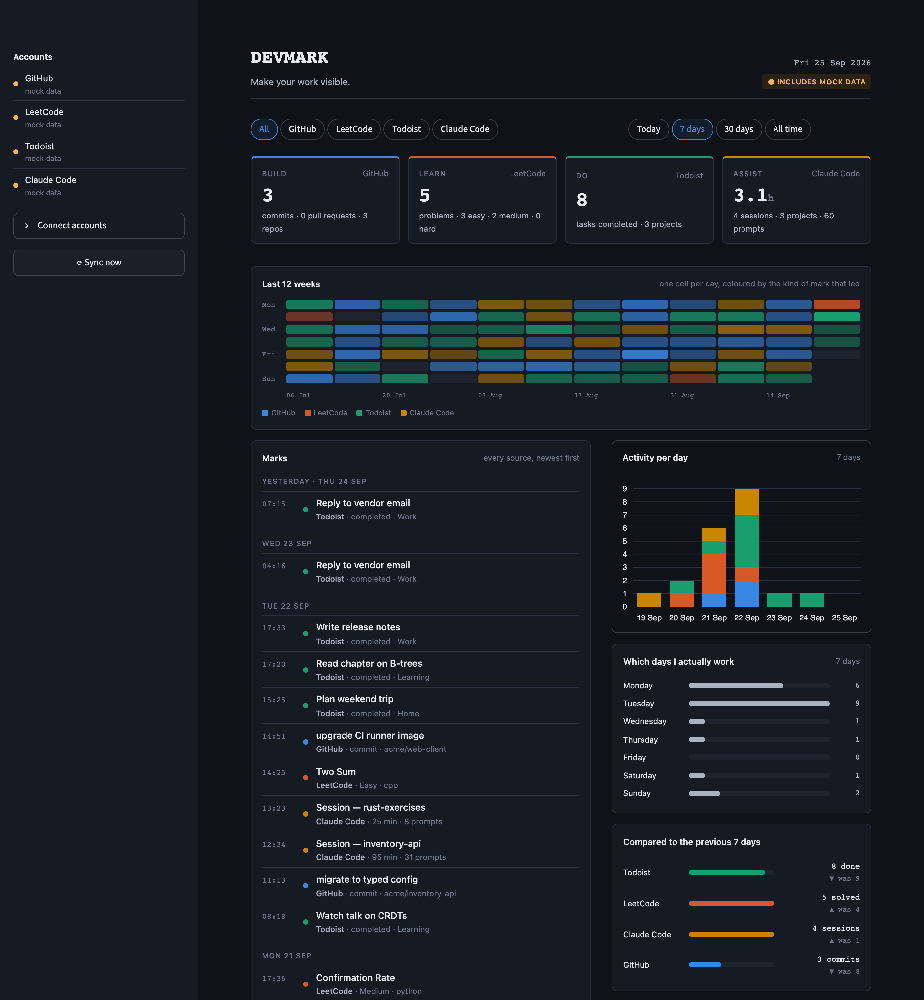

# DEVMARK

**Make your work visible.**

> Your GitHub commits, LeetCode solves, finished tasks and AI coding sessions, brought together on one page.

Every commit, solved problem, completed task or coding session is a **mark** of work.
Those marks live in four different apps, each with its own API, its own idea of time and its own
shape of data. DEVMARK pulls them out, normalizes them into one row shape, stores them in
PostgreSQL and shows them on a single Streamlit page.



| Source | Shows |
|---|---|
| GitHub | commits and pull requests you authored |
| LeetCode | accepted submissions with difficulty and language |
| Todoist | completed tasks with project |
| Claude Code | one row per local session: active time, prompt count |

## Requirements

- [uv](https://docs.astral.sh/uv/)
- PostgreSQL, running locally
  - macOS: `brew install postgresql@18 && brew services start postgresql@18`
  - Ubuntu/Debian: `sudo apt install postgresql && sudo -u postgres createuser -s $USER`
  - Windows: installer from [postgresql.org](https://www.postgresql.org/download/windows/)

## Setup (once)

```bash
git clone https://github.com/mh-1005/devmark.git
cd devmark
uv sync
createdb devmark
cp .env.example .env                # set TIMEZONE; account tokens can be added here or later from the dashboard
uv run python -m scripts.init_db
```

## Run

```bash
uv run devmark
```

## Connect accounts

Credentials can be provided in either of two ways:

- **In the dashboard:** open the sidebar, expand "Connect accounts", enter your tokens, click Save, then "Sync now". Values are written to `.env`.
- **In `.env` directly:** fill in the variables listed under Configuration before starting the app.

Where to get each credential:

- GitHub: Settings → Developer settings → Fine-grained tokens. Read-only `Contents` and `Pull requests`.
- LeetCode: your username from `leetcode.com/u/<username>/`.
- Todoist: Settings → Integrations → Developer → API token.
- Claude Code: nothing to do. It reads `~/.claude/projects`.

The page syncs automatically every 5 minutes while open. From the terminal: `uv run python -m scripts.ingest`.
Open the dashboard at least weekly; free Todoist accounts keep about a week of activity log.

**No accounts yet?** Seed fake data to see the dashboard filled:

```bash
uv run python -m scripts.seed_mock          # add
uv run python -m scripts.seed_mock --clear  # remove
```

## Configuration

All settings live in `.env` (git-ignored). `.env.example` lists them.

| variable | purpose |
|---|---|
| `DATABASE_URL` | e.g. `postgresql+psycopg://localhost:5432/devmark` |
| `TIMEZONE` | IANA name for day boundaries, e.g. `Asia/Karachi` |
| `GITHUB_TOKEN`, `GITHUB_USERNAME` | GitHub |
| `LEETCODE_USERNAME` | LeetCode |
| `TODOIST_API_TOKEN` | Todoist |
| `CLAUDE_PROJECTS_DIR` | only if your Claude Code logs are not in `~/.claude/projects` |
| `USE_MOCK_DATA` | `true` makes every connector return fake data |

## Privacy

Only titles, timestamps, counts and project or repo names are stored. Never conversation text,
task descriptions or code. Tokens stay in `.env` and are never displayed. Nothing leaves your machine.

## Stack

Python 3.12 · uv · PostgreSQL · SQLAlchemy · Streamlit · Plotly · httpx
